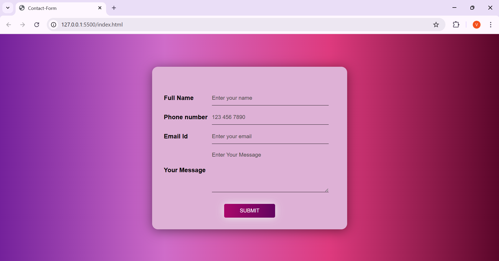

# 📬 Contact Form

A clean and elegant **Contact Form** web app built with HTML, CSS, and JavaScript. This form allows users to enter their name, email, phone number, and a custom message in a stylish and responsive layout.

---

## 🖼️ Preview



---

## ✨ Features

- 🧾 Collects:
  - Full Name
  - Phone Number
  - Email ID
  - Message
- 🎨 Gradient background and glassy form card
- ✅ Form input placeholders for better UX
- 📱 Fully responsive design
- 🖱️ Stylish animated **Submit** button

---

## 💡 What I Practiced

- CSS gradients and layout styling
- Input field design and form structure
- Centered form alignment with Flexbox
- Responsive and accessible design thinking

---

## 🛠️ Tech Stack

- HTML5
- CSS3
- JavaScript validation

---

## 🚀 How to Use

   ```bash
1. Clone the repo:
git clone https://github.com/vinaya2007/Form-Validation.git


2. Navigate to the project folder:
cd Form-Validation

3. Open index.html in your browser.
```

📬 Contact
📧 vinayavinodh07@gmail.com 📞 +91 90032 80933

Credits Built by Vinaya V
